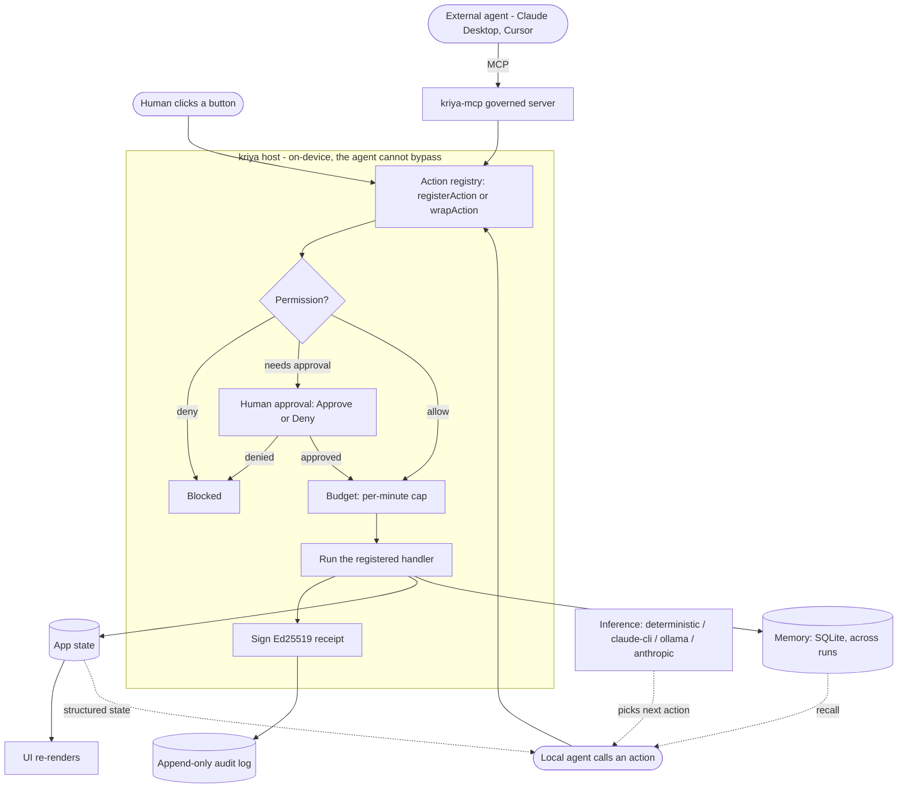

# kriya

> **Build desktop apps that AI agents can understand and operate** — directly, through your app's
> real typed actions, not by screenshotting the screen and guessing where to click.

## The three frontiers of "agent meets software"

AI agents need to operate software. That interaction is splitting into three tiers — two have
emerging standards, one has nothing:

```
                        ┌─────────────────────────────────────────────────────┐
                        │        How agents reach software today              │
                        ├─────────────┬─────────────────┬─────────────────────┤
                        │  Web apps   │   Cloud APIs    │  Desktop / local    │
                        │             │                 │  apps               │
  Standard              │  WebMCP     │   MCP           │  ❌ None            │
                        │  (W3C trial)│   (Linux Fdn)   │                     │
  Agent interface       │  Declared   │   REST / tool   │  Screenshots +      │
                        │  tools in   │   schemas       │  pixel-clicking     │
                        │  the page   │                 │                     │
  Governance            │  Browser    │   Gateway-level  │  ❌ None —          │
                        │  sandbox    │   (immature)    │  can't permission,  │
                        │             │                 │  audit, or gate     │
  Who's building it     │  Google,    │   Anthropic,    │  ← kriya is here    │
                        │  browser    │   OpenAI,       │                     │
                        │  vendors    │   Microsoft     │                     │
                        └─────────────┴─────────────────┴─────────────────────┘
```

**The gap:** a local app with no API and private data — a POS terminal, a finance tool, a
healthcare workstation — can't be governed from the outside. Governance must live where the data
and the human are: **inside the app, on the device.** That's the frontier kriya builds for.
([Full article →](https://medium.com/@sandeepshekhar26/the-three-frontiers-of-agent-meets-software-and-the-one-nobodys-building-for-a7cafda13715))

---

Every app today was built for humans clicking buttons. Now AI agents need to use those same apps —
and they shouldn't have to squint at pixels to do it. With kriya you declare each of your app's
capabilities once as a typed **action**: a human triggers it by clicking, an agent triggers it by
calling it — the *same* code underneath. The agent's entire view of your app is structured state
and a typed menu of what it can do. No screenshots, no DOM scraping, no guessing.

*Think: React/Electron, but for the age of AI agents.* Build a new app this way, or **bolt it onto
an app you already have** — and expose those actions to any agent (Claude Desktop, Cursor, …) over
MCP.

And because an agent operating a real app needs guardrails, kriya bakes them in: every action runs
through **permission → human approval → budget → a signed audit trail**, on-device, before it
touches your data.

<p align="center">
  
  <br><em>An agent operating <a href="https://actualbudget.org">Actual Budget</a> through kriya: routine actions run and are signed; money-moving ones are blocked pending approval; every action verifies offline.</em>
</p>

## Why "kriya"?

**kriya** (Sanskrit, क्रिया) means *action* — and, in grammar, *verb*. That is the whole idea: an
agent shouldn't squint at your pixels, it should **act through your app's verbs**. The unit it
works through is the *kriya* — a single typed, governed action. We bind agents to **actions**, not
to screenshots. Same word, same bet: software you operate by *doing*, whether you're a human or a
machine.

## One app, two doors

```
Human  ──clicks a button──┐
                          ├──▶  the same typed action  ──▶  your handler ──▶ state ──▶ UI
Agent  ──calls an action──┘        (governed: permission · approval · budget · audit)
```

You declare each capability once — `registerAction(...)` for a new app, or `wrapAction(...)` to
adopt one you already have. The agent never simulates a human: it calls the typed action directly,
and it **can't** bypass the gates, because the *host* (not the agent) owns the policy and the
signing key.

## How it fits together

Every path in — a human click, your local agent, or an outside agent over MCP — lands on the same
registry and runs the same gauntlet before it ever touches your data:



The agent's *entire* view of your app is the right-hand side: **structured state** plus a typed
**menu of actions**. It never sees a pixel. The left-hand side — permission, approval, budget,
signing — is enforced in the host process, so a misbehaving or jailbroken agent still can't get
past it.

## What you get

- **Typed actions, not pixels.** Declare a capability once; humans click it, agents call it, both
  run the same handler. The agent reasons over structured state and a typed tool schema — fast and
  reliable, and it doesn't break when you restyle a button.
- **Governance, built in.** Every action an agent proposes runs this gauntlet on-device, before it
  executes:
  1. **Permission** — a deny-by-default policy: allow / require-approval / deny.
  2. **Human approval** — guarded actions pause for an Approve/Deny decision in *your* app's UI.
  3. **Budget** — a per-minute cap stops a runaway or looping agent.
  4. **Signed audit** — an Ed25519 receipt per action → append-only log, verifiable offline.

  Plus persistent **memory** across runs, policy **linting**, and **step-through** debugging.
- **Speaks MCP.** Your actions become MCP tools; the governed `kriya-mcp` server lets any external
  agent drive your app — with every call routed *through* the gates, not around them.
- **Cross-shell.** Runs in a Tauri backend, or as a standalone `kriya-host` sidecar that Electron
  and plain Node apps drive over stdio — governance in a process the renderer can't tamper with.

## Two ways to adopt

**Build a new local-first agent app:**
```bash
npm create kriya-app@latest my-app    # Tauri 2 + React + Rust host, safety layer pre-wired
```

Then declaring a capability is one small block — the *same* handler your button already calls:

```ts
import { registerAction, str } from "kriya-core";

registerAction({
  id: "create_note",
  description: "Create a new note with a title and content.",
  parameters: { title: str, content: str },
  permissions: ["write:notes"],            // policy decides: allow / require approval / deny
  handler: ({ title, content }) =>          // ← your ordinary business logic, nothing special
    db.notes.insert({ title, content }),
});
```

That's the whole contract. A human clicks **New note**; an agent calls `create_note` — both run
the exact same `handler`, and the agent's call still passes permission → approval → budget → audit
on the way in. The agent discovers it automatically (kriya turns it into a typed tool schema), so
you write app logic, not agent plumbing. Adding the next capability is one more `registerAction`.

**Bolt onto an app you already have** — wrap a function it *already exposes*, no rewrite:
```ts
import { wrapAction } from "kriya-core";

wrapAction(actual.updateTransaction, {
  id: "categorize_transaction",
  description: "Assign a category to a transaction.",
  parameters: { id: str, category: str },
  mapParams: (p) => [p.id, { category: p.category }],
});

wrapAction(actual.deleteTransaction, {
  id: "delete_transaction",
  description: "Permanently delete a transaction.",
  parameters: { id: str },
  mapParams: (p) => [p.id],          // policy: require_approval — pauses for a human
});
```

That snippet is the demo above: [`examples/actual-budget-bolt-on/`](examples/actual-budget-bolt-on/)
gives a frontier agent governed access to [Actual Budget](https://actualbudget.org) — a real,
local-first finance app with **no HTTP API** — in ~37 lines, without changing Actual's code.
(`kriya wrap <file>` scaffolds the wrappers from your exported functions.)

> **Fewer lines — and far fewer tokens.** A published benchmark (Reflex, May 2026) ran vision-based
> and typed-action agents on the same task with Claude Sonnet: vision needed **551,000 input tokens
> across 53 steps** (~17 min); typed actions needed **12,000 tokens in 8 calls** (~20 sec) —
> **~45× more tokens and ~50× slower**. In kriya's own Actual Budget demo the ratio is similar:
> categorizing a transaction costs ~700 tokens via a typed action vs. ~8,000–15,000 tokens when
> screenshot-and-clicking the same edit. Typed actions are cheaper *because* the model reasons over
> meaning, not pixels.
> <br><sub>(Benchmark: [Reflex, May 2026](https://medium.com/@sandeepshekhar26/the-three-frontiers-of-agent-meets-software-and-the-one-nobodys-building-for-a7cafda13715); kriya estimate via Anthropic's documented image-token formula.)</sub>

## What's in the box

| Package / crate | What |
|---|---|
| [`kriya-core`](packages/core/) | TypeScript SDK — `registerAction`, `wrapAction`, validation, MCP/JSON-Schema export, the `kriya` CLI (`dump`, `wrap`) |
| [`kriya-sidecar`](packages/sidecar/) | Node/TS binding — host the runtime from Electron or plain Node over stdio |
| [`kriya-inspector`](packages/inspector/) | Drop-in React dev inspector — step log, approval modal, memory replay |
| [`create-kriya-app`](packages/create-kriya-app/) | Scaffolder for a new local-first agent app |
| [`kriya`](crates/kriya/) | Rust agent host — step loop, swappable inference, permissions, budget, signed audit, memory, **governed MCP-server mode** |

**Binaries:** `kriya-mcp` (governed MCP server — external agents drive your app through the gates) ·
`kriya-host` (the stdio sidecar) · [`tools/verify-receipts`](tools/verify-receipts/) (offline audit-log verifier).

**Reference apps:** [`apps/note-app`](apps/note-app/) and [`apps/task-manager`](apps/task-manager/)
— two domains on the one shared host crate.

## Quick start

Try the governed bolt-on with zero setup (in-memory budget, no real data):

```bash
cd examples/actual-budget-bolt-on && ./demo.sh   # builds everything on first run, then plays it
```

Or run the reference desktop app:

```bash
npm install
npm run build --workspace kriya-core
npm run tauri dev --workspace note-app   # first run compiles the Rust backend (a few min)
```

Pick the inference backend with `AGENT_BACKEND` (`deterministic` default, or `claude-cli` /
`ollama` / `anthropic`).

## Docs

- [architecture.md](architecture.md) — how the pattern works, end to end
- [docs/ROADMAP.md](docs/ROADMAP.md) — what's built and what's next
- [docs/PRODUCT_GAPS.md](docs/PRODUCT_GAPS.md) — honest feature-completion tracker

## Why this matters now

- **EU AI Act** high-risk obligations take effect **August 2, 2026** — penalties up to 7% of
  worldwide annual turnover. Agents touching real data need auditable, governed interfaces.
- **Gartner** projects 40% of enterprise apps will embed AI agents by end of 2026 — and 40% of
  enterprises will demote or decommission autonomous agents by 2027 due to governance gaps.
- The **NSA AI Security Center** (May 2026) warned that MCP's rapid adoption has outpaced its
  security model; a **CoSAI** whitepaper identified nearly 40 MCP-specific threats across 12
  categories.
- For desktop/local apps, the only GA product is Microsoft Copilot Studio — still vision-based,
  still ungoverned. That's the gap kriya fills.

## Enterprise — kriya Console

The runtime in this repo makes a *single* app safely agent-drivable, on-device, and stays **MIT,
free, forever**. Organizations running agents across **many** apps, users, and machines need one
layer more: somewhere to oversee and *prove* what every agent did, and to set the policy
centrally. That's **kriya Console** — a separate, commercial product for teams and regulated
deployments, built on top of this open runtime. *The engine is open; the cockpit is paid.*

The Console never changes how the runtime works — it consumes the same Ed25519-signed receipts
and the same `agent-policy.yaml` the open host already emits and enforces:

- **Cross-app audit, verified locally.** Aggregate the signed audit logs from every kriya app and
  verify them on-device — nothing leaves the machine. Tampered or forged entries are flagged,
  giving you one trustworthy view of what every agent across the org actually did.
- **Author policy centrally.** Decide what every agent may do — allow, require approval, or deny —
  across all your apps from one place, spot the actions you haven't governed yet, and validate it
  before it ships. The Console produces the policy the open runtime enforces.
- **The foundation for regulated rollouts.** Tamper-evident audit plus centrally-enforced policy
  is what **EU AI Act** (enforcement opens Aug 2026) and **SOC 2** ask for when an agent touches
  real data — on-device, where cloud MCP gateways structurally can't reach. (One-click
  compliance-evidence export is on the Console roadmap.)

Enterprise & regulated deployments → [kriyanative.com](https://kriyanative.com) ·
Sandeepshekhar26@gmail.com.

## Status

Alpha. The pattern, the cross-shell runtime, and the full safety layer work end-to-end — typed
actions, governed MCP-server mode, the Electron/Node sidecar, the `wrapAction` bolt-on, and the
Actual Budget flagship are all shipped. APIs may still change before a stable release. MIT licensed.
