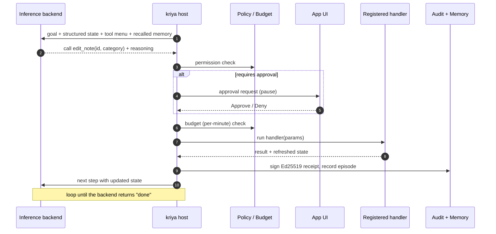
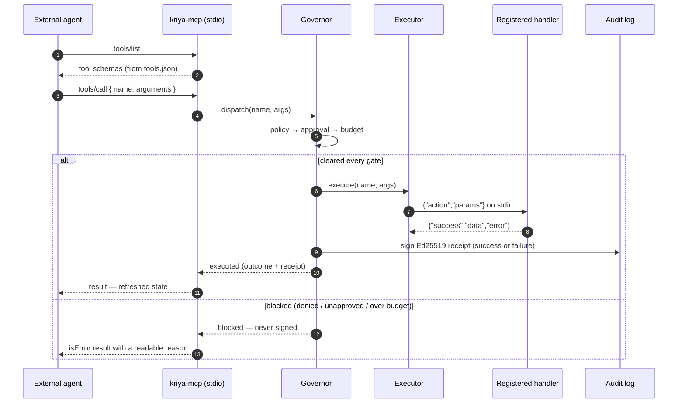

# Architecture

This document explains the pattern the reference apps prove: **a local agent driving a
real desktop app through typed actions and structured state — no vision, no screenshots, no
DOM selectors.** It is built on the final stack (Tauri 2 + Rust + TypeScript + React), kept
deliberately small so the pattern is legible.

> **Note (updated 2026-06-15):** the *pattern* below is current and accurate, but two things have
> moved on since this was first written. (1) The Rust agent host is now a **shared crate**
> (`crates/kriya`) consumed by both reference apps, not code inside one app — decision
> [D-002](docs/DECISIONS.md). (2) Most items in the old *"deliberately leaves out"* list have since
> shipped. For current feature state see [docs/PRODUCT_GAPS.md](docs/PRODUCT_GAPS.md); for what's
> next and the strategic direction see [docs/ROADMAP.md](docs/ROADMAP.md) and [CLAUDE.md](CLAUDE.md).
>
> **Note (added 2026-06-24, [D-016](docs/DECISIONS.md)):** this file explains the *bolt-on / in-process
> pattern*. The forward-looking **service architecture** — one governance core + three reach fronts
> (a zero-change stdio **proxy** in front of any MCP server, an OS-accessibility **reach-in** for
> no-API apps, computer-use fallback), shipped as a standalone **`kriya-gateway` product** — lives in
> **[docs/SERVICE-ARCHITECTURE.md](docs/SERVICE-ARCHITECTURE.md)** with tech + sequence diagrams and
> the build-over plan. The MCP-server mode below (`kriya-mcp`) is the seam the proxy front extends.

## The core idea

A traditional app has one entry point: a human clicking UI. An kriya app has **two
entry points into the same business logic**.

```
   Human  ──click "Add"──────────┐
                                 ├──▶  registered action handler  ──▶  app state  ──▶  UI
   Agent  ──call edit_note(...)──┘
```

Both a button click and an agent tool call land on the *same* registered action. The agent
never simulates a human — it calls the affordance directly.

## One action, end to end

What actually happens when the agent decides to do something — every gate is enforced by the
host, not the agent:



The agent only ever produces the one arrow that matters — *"call this action with these
params."* Everything else (approval, budget, signing, state) is the host's job.

## The three layers

```
┌──────────────────────────────────────────────────────────────────────┐
│  FRONTEND  (React + TypeScript, in the Tauri webview)                 │
│                                                                      │
│   kriya-core                                                 │
│     registerAction({ id, description, parameters, permissions,       │
│                       handler })          ← declare an affordance     │
│     getToolSchemas()  → MCP-style tool schemas (no handlers)         │
│     dispatchAction(id, params, ctx) → runs the handler, mutates store │
│                                                                      │
│   store.ts   notes = single source of truth (observable)             │
│   actions.ts create_note / edit_note / delete_note                    │
│   agent.ts   bridges host events ↔ the registry                      │
└──────────────────────────────────────────────────────────────────────┘
        │  invoke("agent_start", { goal, state, tools })   (app → host)
        │  invoke("agent_action_result", { result })       (app → host)
        ▲  event "agent://action"  { actionId, params, reasoning }  (host → app)
        ▲  event "agent://done" / "agent://log"                     (host → app)
        │
┌──────────────────────────────────────────────────────────────────────┐
│  AGENT HOST  (Rust, in the Tauri backend)                            │
│                                                                      │
│   host.rs         the step loop (init → step → result → step → done)  │
│   inference/      swappable backends behind one trait:               │
│       deterministic   scripted planner, zero cost (default)          │
│       claude_cli      shells out to the local `claude` CLI            │
│   permissions.rs  policy check before every action (deny by default) │
│   audit.rs        Ed25519-signed receipt per action → JSONL log      │
└──────────────────────────────────────────────────────────────────────┘
```

## One step of the loop, end to end

The agent's task: *"organize every note by assigning each a sensible category."*

1. **Start.** The frontend calls `invoke("agent_start", { goal, state, tools })`. `state` is
   `{ notes: [...] }`; `tools` is the output of `getToolSchemas()` — the JSON contract for
   `create_note`, `edit_note`, `delete_note`. The host spawns the loop on its own thread.

2. **Decide.** The inference backend reads the goal, current state, tool schemas, and history,
   and returns one decision: `Call { action_id, params, reasoning }` or `Done { summary }`.
   The deterministic backend finds the first uncategorized note, keyword-classifies it, and
   returns `edit_note(id, category)`. An LLM backend returns the same shape.

3. **Gate.** `permissions.rs` checks the action against the policy. `edit_*` is allowed;
   `delete_*` would require human approval; anything unmatched is denied. The **host** owns this
   decision — the agent cannot bypass it.

4. **Dispatch.** The host registers a one-shot channel keyed by a fresh `stepId`, emits
   `agent://action`, and blocks waiting for the result.

5. **Execute.** The frontend's `agent.ts` receives the event and calls
   `dispatchAction(actionId, params, { caller: "agent", stepId })` — the **same** registry path
   a human button uses. The handler mutates the store; React re-renders the note with its new
   category badge.

6. **Report.** The frontend sends `invoke("agent_action_result", { stepId, success, state })`
   carrying the refreshed state. The host's channel unblocks.

7. **Sign.** `audit.rs` signs a receipt `{ stepId, actionId, params, success, ts }` with an
   Ed25519 key the agent never holds, appends it to `kriya-audit.jsonl`, and emits a log
   line for the inspector.

8. **Loop.** The host feeds the new state back to the backend and repeats from step 2 until the
   backend returns `Done`, which fires `agent://done`.

No pixels are read. No coordinates are clicked. The agent's entire view of the app is structured
JSON, and its entire vocabulary is the typed tool schema.

## Why each piece is the way it is

- **State lives in the frontend.** The app owns its data as usual; the host stays stateless
  about app contents and just relays decisions. Each result carries a fresh snapshot, so the
  backend always reasons over current truth.
- **Inference is a trait, not a hardcoded model.** `deterministic` proves the wiring with zero
  cost and full determinism; `claude_cli` proves a real LLM drops into the identical loop. API
  backends (Anthropic, Ollama) implement the same `Inference` trait later — the loop never changes.
- **The host, not the agent, enforces policy and signs receipts.** Permission checks and the
  signing key sit on the Rust side. An agent can *propose* `delete_note`; it cannot *approve* it
  or forge a receipt.
- **The protocol mirrors JSON-RPC request/response**, keyed by `stepId`, so it ports cleanly off
  Tauri IPC to WebSocket/HTTP later (dev inspector, hosted cloud) without reshaping messages.

## Two front-ends onto one registry: governed MCP-server mode

The loop above is the **in-process** front-end: the Rust host drives the registry directly over
Tauri IPC. **Governed MCP-server mode** (roadmap [R1](docs/ROADMAP.md)) is the *second* front-end
onto the same registry — it exposes the exact same actions to an **external** agent (Claude
Desktop, Cursor, …) speaking the real Model Context Protocol, and routes every call through the
**same** policy → approval → budget → signed-audit gates. The app is written once; a human button,
the in-process agent, and an outside MCP client all land on the same handler.

This is **not a new protocol.** `kriya-mcp` *speaks* MCP — JSON-RPC 2.0 with `initialize` /
`tools/list` / `tools/call`, protocol revision `2025-06-18`, the spec's `Tool` and `CallToolResult`
shapes. The differentiator is not the tool exposure (any MCP server does that); it is that **every
`tools/call` is governed before it reaches the app.** The governance is the add-on, not the wire
format.

### From a registered action to a governed MCP tool

```
  registerAction({ id, parameters, permissions, handler })   ← your app (TypeScript),
        │                                                       the same handler a button calls
        │  getToolSchemas()  →  MCP tool schemas: { name, description, inputSchema }
        │                       inputSchema is JSON Schema (draft 2020-12); handlers stripped
        ▼
  kriya dump app.js  >  tools.json        ← the live registry, frozen to a static schema file
  ───────────────────────────────────────  process boundary: Node → Rust
        ▼
  kriya-mcp --tools tools.json --policy policy.yaml --exec "node handler.js"
        │   stdio JSON-RPC: initialize · tools/list (discovery) · tools/call (governed)
        ▼
  Governor:  policy → approval → budget → execute → Ed25519 receipt
        │    execute() is a trait; the bolt-on executor writes one line of
        │    {"action","params"} and reads back {"success","data","error"}
        ▼
  handler.js  →  dispatchAction(id, params, { caller: "agent" })   ← back in your app,
                                                                      the SAME registry path
```

Three things build that chain:

1. **Export** — `getToolSchemas()` ([`registry.ts`](packages/core/src/registry.ts)) walks the
   registry and emits one MCP-compatible schema per action, dropping the handler. `paramsToJSONSchema()`
   ([`jsonschema.ts`](packages/core/src/jsonschema.ts)) lifts kriya's compact `ParameterSchema` into
   standards-compliant JSON Schema (per-property `required` → object-level `required[]`), so strict
   validators like the Anthropic tool API accept it.
2. **Freeze** — `kriya dump <entry>` ([`cli.ts`](packages/core/src/cli.ts)) imports the app's action
   module (registration is a side effect) and prints those schemas as `tools.json`.
3. **Serve** — the `kriya-mcp` binary ([`src/bin/kriya-mcp.rs`](crates/kriya/src/bin/kriya-mcp.rs))
   loads `tools.json` + a policy and runs the JSON-RPC loop. `--exec` names the per-call handler;
   `--persistent` keeps it alive across calls (for handlers holding an expensive connection);
   `--approval deny|tty|gui|auto` decides guarded actions; `--actor`/`--user` stamp the receipt's
   identity (R8).

### One external `tools/call`, end to end



### Why it is built this way

- **Identical gates to the in-process host.** The governor ([`mcp/governor.rs`](crates/kriya/src/mcp/governor.rs))
  runs the same deny-by-default policy, human approval, per-minute budget, and signed audit the host
  enforces — the external agent gets capability, the host keeps control. A *proposing* agent can
  never *approve* its own guarded call or forge a receipt; the signing key stays in Rust.
- **Blocked calls are not signed.** Receipts attest to what actually ran, matching the host's audit
  semantics. A denied / unapproved / over-budget call comes back to the agent as an MCP *error result*
  (`isError: true`) it can read and reason about — not a JSON-RPC protocol error (those are reserved
  for malformed or unknown requests).
- **Execution and approval are traits.** [`ActionExecutor`](crates/kriya/src/mcp/executor.rs)
  abstracts *how* a cleared action runs — a Tauri webview dispatch, a sidecar (R3), or the
  dependency-free `ProcessExecutor` / `PersistentProcessExecutor` that shells out over the line
  contract above. The governance never changes; only the last hop does.
- **This is the bolt-on.** An existing app gains a governed agent surface by pointing `kriya-mcp` at
  a schema file and a handler — no rewrite of its own code. See
  [`examples/replicad-bolt-on/`](examples/replicad-bolt-on/): a governed agent over a real OpenCascade
  CAD model, wired with a [`.mcp.json`](examples/replicad-bolt-on/.mcp.json) and a persistent
  [`src/handler.ts`](examples/replicad-bolt-on/src/handler.ts).

## Beyond Phase 0 (mostly shipped)

The seams Phase 0 stubbed have since landed: the **human-approval queue** (host blocks on a
per-step channel, frontend modal), **persistent agent memory** (SQLite, across runs), the
**offline receipt verifier** (`tools/verify-receipts`), the **`create-kriya-app` scaffolder**,
plus **action composition**, **resume-ability**, **step-through**, and **policy linting**. Two
reference apps (notes + tasks) now share the extracted `kriya` crate, each plugging
in its own scripted planner. The strategic builds that were next when this was written —
governed MCP-server mode (the section above), the sidecar/Electron host, and the `wrapAction`
bolt-on — have since shipped, so the in-process pattern now has an external twin. Still open:
hot-reload of the registry. See [docs/ROADMAP.md](docs/ROADMAP.md) and
[docs/PRODUCT_GAPS.md](docs/PRODUCT_GAPS.md).

## File map

| Concern | File |
|---|---|
| Action registry + validation | `packages/core/src/registry.ts` |
| Action / schema / result types | `packages/core/src/types.ts` |
| Agent loop protocol (TS) | `packages/core/src/protocol.ts` |
| Note affordances | `apps/note-app/src/actions.ts` |
| Frontend ↔ host bridge | `apps/note-app/src/agent.ts` |
| Step loop | `crates/kriya/src/agent/host.rs` |
| `Inference` trait + LLM backends (claude-cli / ollama / anthropic) | `crates/kriya/src/agent/inference/` |
| Permission policy + linting | `crates/kriya/src/permissions.rs` |
| Signed audit trail | `crates/kriya/src/audit.rs` |
| Budget + persistent memory | `crates/kriya/src/{budget,memory}.rs` |
| Protocol (Rust) | `crates/kriya/src/protocol.rs` |
| MCP tool-schema export (TS) | `getToolSchemas()` in `packages/core/src/registry.ts`, `packages/core/src/jsonschema.ts` |
| `kriya` CLI (`dump` schemas / `wrap` codemod) | `packages/core/src/cli.ts` |
| Governed MCP server (Rust) | `crates/kriya/src/mcp/` — `jsonrpc`, `server`, `governor`, `executor`, `approval` |
| `kriya-mcp` binary | `crates/kriya/src/bin/kriya-mcp.rs` |
| App-specific deterministic planner + Tauri glue | `apps/note-app/src-tauri/src/{deterministic,lib}.rs` (task-manager mirrors this) |
