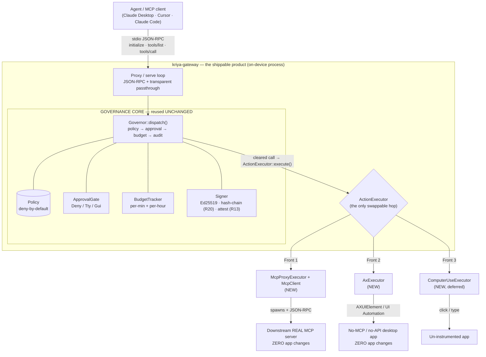
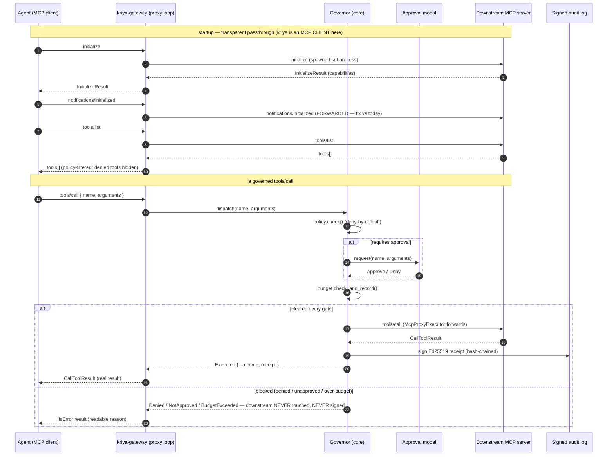

# Service Architecture — the governance core + three reach fronts + the shippable gateway

> **Status: Accepted architecture (2026-06-24), decision [D-016](DECISIONS.md).** This is the
> canonical *build* document for the D-016 pivot: one governance core, three interchangeable reach
> fronts, shipped as a standalone product. The *why* lives in
> [strategy/governed-local-first-wedge.md](strategy/governed-local-first-wedge.md); the *pattern*
> (one action end-to-end) lives in [../architecture.md](../architecture.md); *what to build next* in
> [ROADMAP.md](ROADMAP.md) (R22–R26); *feature state* in [PRODUCT_GAPS.md](PRODUCT_GAPS.md) §8.
>
> Grounded in a code-seam audit (2026-06-24) of `crates/kriya/src/mcp/` — every signature below is
> verbatim from the source.

## 0. The verdict: build over the existing core. No rewrite.

The existing crate was *already* built with the exact seam D-016 needs. `Governor::dispatch()` runs
the full `policy → approval → budget → execute → audit` sequence and is **transport-agnostic — it has
zero IO and knows nothing about JSON-RPC**. The only thing it varies is one injected trait, the
`ActionExecutor` ("the last hop"). Every front is therefore *a new `ActionExecutor` plus a way to
discover its tools* — the governance never changes.

```
THE WHOLE BET IN ONE TRAIT:

  pub trait ActionExecutor: Send {
      fn execute(&mut self, action_id: &str, params: &Value) -> ActionOutcome;
  }
                   ▲
   Front 1 ────────┤  McpProxyExecutor  → forwards a CLEARED call to a downstream MCP server
   Front 2 ────────┤  AxExecutor        → performs a CLEARED call over the OS accessibility tree
   Front 3 ────────┘  ComputerUseExecutor → performs a CLEARED call via pixels (fallback)

  Behind it, UNCHANGED:  Governor · Policy · ApprovalGate · BudgetTracker · Signer (Ed25519 + R20 chain + R13 attest)
```

So this is **build-over**, and the new surface area is small and well-bounded. The one genuinely new
subsystem is an **MCP _client_** (kriya has only ever been an MCP *server*; Front 1 needs it to also
*speak to* a downstream server).

## 1. Tech diagram — core + three fronts



**Reading it:** an agent talks to `kriya-gateway` exactly as it would talk to any MCP server (stdio
JSON-RPC). Inside, the proxy loop hands every `tools/call` to the unchanged `Governor`. A cleared
call drops to whichever `ActionExecutor` is wired — and only *that* bottom edge differs per front.
The target app (downstream MCP server, or a no-API desktop app) is **never modified**.

## 2. Sequence diagram — one external `tools/call` through Front 1 (the proxy)



This is the demo beat: a destructive `tools/call` (e.g. `delete_transaction`) **pauses on the
approval modal before the downstream server ever sees it**, and a cleared call comes back with a
signed, hash-chained receipt — on an app and an MCP server we did not write.

## 3. The seam, verbatim (what we reuse unchanged)

From the 2026-06-24 seam audit of `crates/kriya/src/mcp/`:

```rust
// executor.rs:32 — the one swappable hop
pub trait ActionExecutor: Send {
    fn execute(&mut self, action_id: &str, params: &Value) -> ActionOutcome;
}
pub struct ActionOutcome { pub success: bool, pub data: Value, pub error: Option<String> }

// approval.rs:12 — pluggable human-in-the-loop (Deny / Tty / Gui / Auto all reusable)
pub trait ApprovalGate: Send {
    fn request(&self, action_id: &str, params: &Value) -> bool;
}

// governor.rs — transport-agnostic, zero IO; THIS IS THE CORE
pub enum DispatchOutcome {
    Denied, NotApproved, BudgetExceeded(String),
    Executed { outcome: ActionOutcome, receipt: SignedReceipt },
}
impl Governor {
    pub fn new(policy: Arc<Policy>, signer: Arc<Signer>,
               approval: Box<dyn ApprovalGate>, executor: Box<dyn ActionExecutor>) -> Self;
    pub fn with_actor(mut self, actor: Option<Actor>) -> Self;          // R8 attribution
    pub fn dispatch(&mut self, action_id: &str, params: &Value) -> DispatchOutcome;
}
```

| Component | File | Status for the fronts |
|---|---|---|
| `Governor` (the gate sequence) | `crates/kriya/src/mcp/governor.rs` | **reuse unchanged** |
| `ApprovalGate` + Deny/Tty/Gui/Auto | `crates/kriya/src/mcp/approval.rs` | **reuse unchanged** |
| `Signer` / `SignedReceipt` / `Actor` (Ed25519, R20 hash-chain, R13 attest) | `crates/kriya/src/audit.rs` | **reuse unchanged** |
| `BudgetTracker` (per-min + per-hour) | `crates/kriya/src/budget.rs` | **reuse unchanged** |
| `Policy` / `Decision` (deny-by-default) | `crates/kriya/src/permissions.rs` | **reuse + add tool-discovery filtering** |
| JSON-RPC + MCP types (`Request`, `Response`, `Tool`, `CallToolParams`, `CallToolResult`, `InitializeResult`) | `crates/kriya/src/mcp/jsonrpc.rs` | **reuse** (the same shapes serve the new client side) |
| `Server::serve()` request/response loop | `crates/kriya/src/mcp/server.rs` | **extend** (passthrough — see §4) or wrap in a new proxy loop |

## 4. Front 1 — the stdio governance proxy (the headline)

**What it is:** a binary the agent's MCP client launches *instead of* the real server. It spawns the
real server as a child, governs every `tools/call`, and is otherwise transparent.

**New modules (small, bounded):**

- **`mcp/client.rs` — `McpClient`** (the missing half). Spawns the downstream server
  (`std::process::Command` with `.stdin(piped).stdout(piped).stderr(inherit)`, the exact pattern
  already proven in `PersistentProcessExecutor`), keeps an id counter, and exposes
  `initialize()` / `list_tools()` / `call_tool(name, args)` by writing newline-delimited JSON-RPC to
  the child's stdin and reading responses from its stdout. Reuses the `jsonrpc.rs` types as-is.
- **`mcp/proxy_executor.rs` — `McpProxyExecutor: ActionExecutor`** (the only new executor needed for
  Front 1). `execute(name, params)` → `McpClient::call_tool` → map `CallToolResult` → `ActionOutcome`.
  This is what `Governor` calls on a cleared call.
- **Proxy serve loop** (extend `server.rs` or add `mcp/proxy_server.rs`) handling the four
  passthrough fixes below.
- **New product binary `kriya-gateway`** (see §7) with a `proxy` subcommand; gated behind a new
  off-by-default `mcp-client` feature so the library stays lean (mirrors `tauri-host` / `http-inference`).

**The four blocking changes the seam audit found (must do, or strict clients break):**

1. **Notifications must be forwarded both ways.** Today `Server::handle()` returns `None` for any
   notification (`id.is_none()`) and drops it. A downstream server *expects* `notifications/initialized`.
   → forward client→downstream and downstream→client notifications.
2. **Unknown methods must pass through.** Today unknown methods return `METHOD_NOT_FOUND`. A real
   server may speak `resources/list`, `prompts/list`, server-initiated `sampling/*` or `elicitation/*`.
   → forward any non-`tools/*` method verbatim to the downstream and relay the reply.
3. **`tools/list` must be dynamic, not from a static file.** Today `Server::new()` takes schemas
   upfront. → on startup, call downstream `tools/list` once, cache, and serve it.
4. **`tools/list` must be policy-filtered.** Today only `tools/call` is gated. → hide tools the policy
   denies, so a denied capability never appears to the agent (defense in depth + cleaner UX).

**Threading note (engineering judgment — pick the tier the conformance bar demands):**

- **MVP (covers the large majority of tool servers):** synchronous request/response — client request
  → govern → forward → reply; forward the `initialized` notification. Server-*initiated* traffic
  (downstream→client sampling/elicitation) is rare for plain tool servers and can be deferred.
- **Full lifecycle conformance:** two reader threads (client-reader, downstream-reader) with the
  `Governor` behind a `Mutex`, routing by direction and JSON-RPC id. Required for downstream servers
  that initiate sampling/elicitation. **Build a passthrough conformance test** (the open question
  D-016 flagged) before claiming "wraps any MCP server."

**Id-correlation rule:** echo the client's request id back exactly; use a disjoint range for the
proxy's *own* requests to the downstream (e.g. client ids passthrough, proxy ids start at 1<<32).

## 5. Front 2 — the reach-in adapter (no MCP, no API; the hardest-to-copy moat)

For an app with **no MCP server and no API**, synthesize a governed MCP server *from the OS
accessibility tree* — do not fall back to pixels.

- **Schema source:** walk the target app's accessibility tree → emit one MCP `Tool` per actionable
  element (macOS `AXUIElementCopyActionNames`; Windows UI Automation control patterns). This replaces
  the static `tools.json`.
- **`AxExecutor: ActionExecutor`:** on a cleared call, perform the action (macOS
  `AXUIElementPerformAction`/`AXPress`; Windows UIA `Invoke`/`Value`). Same `Governor` above it.
- **Platform:** macOS `AXUIElement` first (FFI to `ApplicationServices`), Windows UIA second.

**Honest scope (the one refuted research claim — do not oversell):** accessibility-driven typed
actions degrade on custom-drawn / Electron / Qt / web-embedded UIs, need a user-granted permission,
block App-Store sandboxing, and can't drive elevated apps. **Gate this front on measuring the
coverage ratio on 5 real ICP apps** (POS / CRM / regulated) before committing it to a pitch.

## 6. Front 3 — governed computer-use (the universal floor) — **active (D-017)**

**Promoted from "deferred" to a first-class front (D-017).** Computer-use is the *universal* reach
mechanism: it drives **any** app via pixels, so no app is ever unsupported. The differentiator vs an
ungoverned computer-use agent (e.g. Cowork) is that **every action is routed through the unchanged
`Governor`** — policy → approval → budget → signed audit — before it fires.

Built as a fixed, system-wide tool set (not synthesized from an app): `computer_screenshot`,
`computer_click {x,y,button?}`, `computer_move {x,y}`, `computer_type {text}`, `computer_key {key}`,
`computer_scroll {x,y,dx,dy}`. The macOS executor performs them via CoreGraphics `CGEvent` (mouse,
scroll, keyboard) + `screencapture` (screenshot → base64 PNG). Same `Governor` above it; exposed
**system-wide** via `kriya-gateway computer-use` (no `--app` — it governs the whole desktop).

**Honest scope:** governance here is **coarse** — you gate/audit *clicks and keystrokes*, not
semantic actions (pixels carry no named operation to deny-by-default). The value at this tier is the
**signed audit trail of everything the agent did on screen + approval gates**, not deny-by-default of
a named action. Needs **Screen Recording** permission (for screenshots) on top of Accessibility.

## 6a. The 4-tier reach model + the router (D-017)

A single gateway reaches a target by the **richest available** mechanism; governance *richness* is
tiered by how instrumented the app is:

| Tier | App exposes | Reach | Governance |
|---|---|---|---|
| **Proxy / bolt-on** | MCP server / named handlers | narrow | **rich, semantic** (deny/approve a named action) |
| **Reach-in** | accessibility tree | medium | medium (named element) |
| **Computer-use** | nothing | **everything** | **coarse** (click/keystroke) |

**"Support everything, sell governance":** computer-use is the universal floor (Act 1, operability —
the part Cowork also does, but ungoverned); the governance is richest where the app cooperates (Act
2, the moat). The **router** (`kriya-gateway router`) is one gateway / one policy / one signed audit
that exposes the computer-use floor + a `list_apps` discovery tool and (v2) **auto-selects the richest
tier per app** (proxy → bolt-on → reach-in → computer-use). **Reach-in is the *middle* tier, not the
headline** — it races computer-use on reach and loses; lead governance demos with the bolt-on
(semantic). The durable moat is **vendor-neutral** (governs any MCP agent, not just Claude) +
**app-owner-defined, on-device, tamper-evident, compliance-grade** governance — not "we can drive
apps." See [DECISIONS.md](DECISIONS.md) D-017.

## 7. The shippable product — `kriya-gateway`

The architecture above is necessary but not sufficient: today's invocation is developer-facing
(`kriya-mcp --tools tools.json --policy policy.yaml --exec "node handler.js"`). The product is a
**downloadable binary a non-author points at any existing MCP server with zero integration code.**

**Today (developer / bolt-on, keep it):**
```
kriya-mcp --tools tools.json --policy policy.yaml --exec "node handler.js" --approval gui
```

**Tomorrow (product, zero-config) — drops straight into a client's MCP config:**
```jsonc
{
  "mcpServers": {
    "actual-budget": {
      "command": "kriya-gateway",
      "args": ["proxy", "--", "node", "actual-mcp-server.js"]
    }
  }
}
```
`kriya-gateway` spawns the downstream server, **auto-discovers its tools**, applies a **default
deny-by-default policy** (reads allow; `delete_*`/`remove_*`/`destroy_*` require approval; else deny),
fires the **approval modal** on destructive calls, and writes a **signed, hash-chained audit** — no
schema file, no policy file, no handler, no change to the downstream server or the app.

**One product binary, subcommands (recommended):**
- `kriya-gateway proxy -- <downstream cmd>` — Front 1 (the headline).
- `kriya-gateway serve --tools … --exec …` — the existing `kriya-mcp` bolt-on (enterprise depth / `wrapAction`).
- `kriya-gateway reach-in --app "<App Name>"` — Front 2 (later).

**Product gaps to close for R24 (from the seam audit):**
- Zero-config **default policy generator** (borrow `permissions.rs` default-case logic).
- **Config file** discovery (`.kriya.yaml`: policy/approval/audit-log/signing-key) so no flags needed.
- **Cross-platform approval:** Tty fallback everywhere + macOS Gui today; Windows/Linux GUI later.
  (Validate audit-log/signing-key paths *before* handing to `Signer` — it currently hard-fails on a
  bad path; turn that into a clean startup error.)
- **On-startup on-device attestation** (R13 `kriya.attestation.on_device` receipt) when a persisted
  `--signing-key` is set — so the audit trail is pinned, not ephemeral.
- **Warn on policy/tool mismatch:** if a policy rule names a tool the downstream never declares, warn
  at startup (silent no-ops are a security footgun).
- **Distribution:** signed binaries — macOS `.dmg`/Homebrew (codesign), Windows `.msi`/winget
  (Authenticode), Linux self-contained. Pinned public key for offline receipt verification.

**The "MCP gateways are a bad idea" rebuttal, baked into the design:** this is **local-only, per-host
stdio interposition with no credential aggregation** — an on-device valve, not a central cloud
secret-hoard. Keep it that way (no central proxy that brokers many servers' credentials).

## 8. Build-over plan — module map

| New / changed | Path | Front | Notes |
|---|---|---|---|
| `McpClient` (spawn + JSON-RPC to downstream) | `crates/kriya/src/mcp/client.rs` (new) | 1 | reuses `jsonrpc.rs` types + the `PersistentProcessExecutor` spawn pattern |
| `McpProxyExecutor: ActionExecutor` | `crates/kriya/src/mcp/proxy_executor.rs` (new) | 1 | the only new executor for Front 1 |
| Proxy serve loop (passthrough + dynamic/filtered `tools/list`) | extend `crates/kriya/src/mcp/server.rs` or new `proxy_server.rs` | 1 | the four fixes in §4 |
| `mcp-client` feature flag | `crates/kriya/Cargo.toml` | 1 | off by default (lean lib) |
| `kriya-gateway` binary (subcommands) | `crates/kriya/src/bin/kriya-gateway.rs` (new) | all | product face; default policy, config file, attestation |
| Default-policy generator | `crates/kriya/src/permissions.rs` (extend) | product | reads allow / destructive→approve / else deny |
| `AxExecutor` + accessibility schema synth | `crates/kriya/src/mcp/ax/` (new, macOS first) | 2 | FFI to `ApplicationServices`; coverage-gated |
| `ComputerUseExecutor` | `crates/kriya/src/mcp/computer_use.rs` (new) | 3 | deferred |
| Passthrough conformance test | `crates/kriya/tests/` | 1 | proves "wraps any MCP server" |

**Reused entirely unchanged:** `governor.rs`, `approval.rs`, `audit.rs`, `budget.rs`, the
`jsonrpc.rs` types, `Policy` matching. That is the whole point — the moat (the core) does not move;
only reach is added.

## 9. Risks & open questions (carried from D-016)

- **Lifecycle conformance** — does the proxy transparently pass `initialize`/capabilities,
  notifications, cancellation, and server-initiated sampling/elicitation without breaking strict
  clients? Resolve with the conformance test before the "wraps any MCP server" claim.
- **Front-2 coverage ratio** — unproven; measure on 5 real ICP apps before betting the reach-in
  narrative on a deck. The "control *any* macOS app" claim was research-refuted.
- **Budget scope** — one `BudgetTracker` must span all downstream calls of a session (the proxy *is*
  the handler from the budget's view), so a runaway agent is capped by the proxy, not per-tool.
- **Topology** — the proxy is bypassable unless we own the launch / lock the client config (D-016
  trade-off table). The strong-topology mode remains in-process `wrapAction` (`serve`), sold as
  enterprise depth.
- **Attestation root** — pin the signing key (R20) and root attestation in TPM/Secure Enclave so the
  enforcer is non-bypassable; do this before any public "tamper-evident" claim.

## 10. Roadmap mapping

R22 `McpClient` + `McpProxyExecutor` → R23 Front-1 transparent proxy (the four §4 fixes + conformance
test) → **R24 the shippable `kriya-gateway` product** (zero-config, default policy, cross-platform
approval, attestation, signed installers) → R25 Front-2 reach-in (macOS AX first, coverage-gated) →
R26 Front-3 computer-use (deferred). See [ROADMAP.md](ROADMAP.md).
